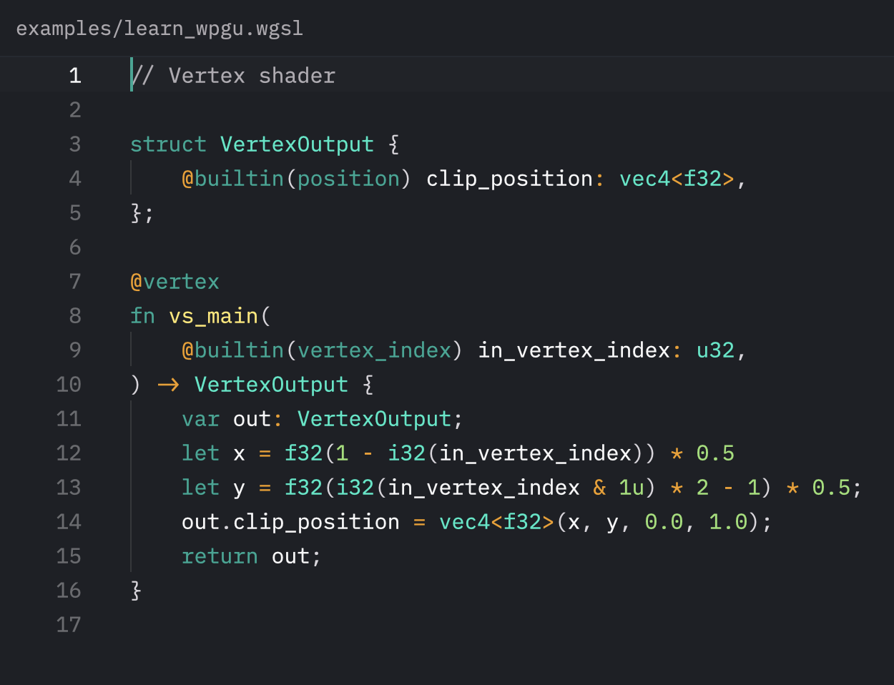

# WGSL



WGSL language support with rich syntax highlighting. Powered by the
[wgsl-analyzer LSP](https://github.com/wgsl-analyzer/wgsl-analyzer).

Based on [Konrad Bochnia's WGSL Tree-sitter grammar](https://github.com/szebniok/tree-sitter-wgsl),
this extension improves upon the highlights to distinguish a wider variety of
syntax.

_Note_: I don't own or maintain the wgsl-analyzer language server, only this Zed
extension.

## Installation

To use this extension, manually install the LSP using the binary name
"wgsl_analyzer", following the instructions in [the wgsl-analyzer README](https://github.com/wgsl-analyzer/wgsl-analyzer/blob/main/README.md).

Automatic installation of the LSP isn't currently possible, since the LSP
repository doesn't publish binary artifacts in its releases.

## Configuration

### Language

This extension adds WGSL support to Zed under the identifier "WGSL".

`.wgsl` files will be automatically identified as WGSL.

Zed's WGSL settings can be configured like so:

```json
{
    "languages": {
        "WGSL": {
            // ...
        }
    }
}
```

### wgsl-analyzer

wgsl-analyzer can be configured like any other LSP, using the language server
ID `wgsl-analyzer`:

```json
{
    "lsp": {
        "wgsl-analyzer": {
            // ...
        }
    }
}
```

The full list of supported options [is available here](https://github.com/wgsl-analyzer/wgsl-analyzer/blob/main/editors/code/README.md).
